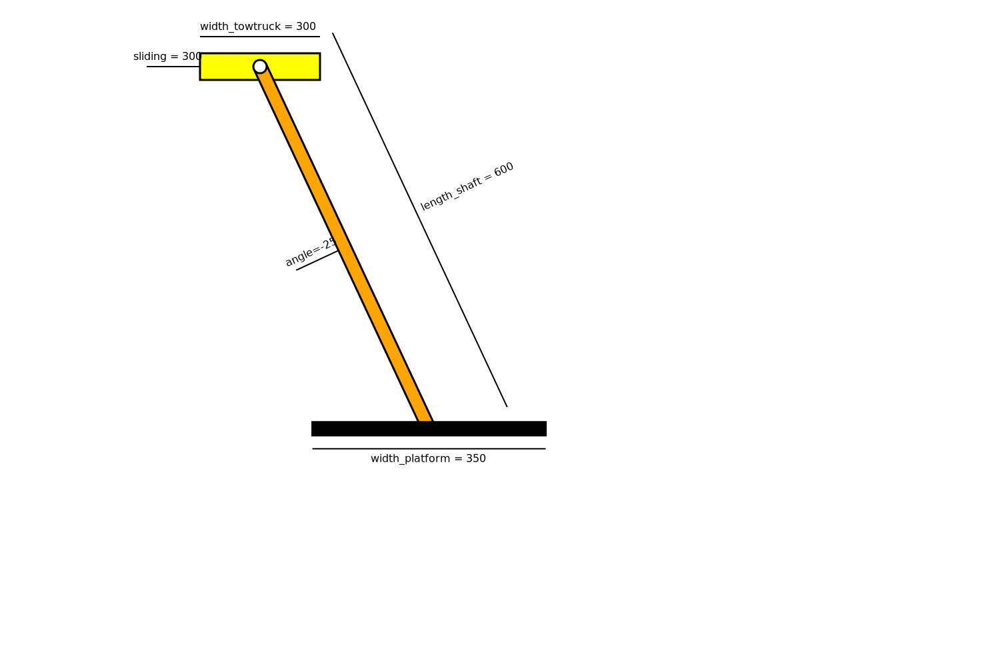
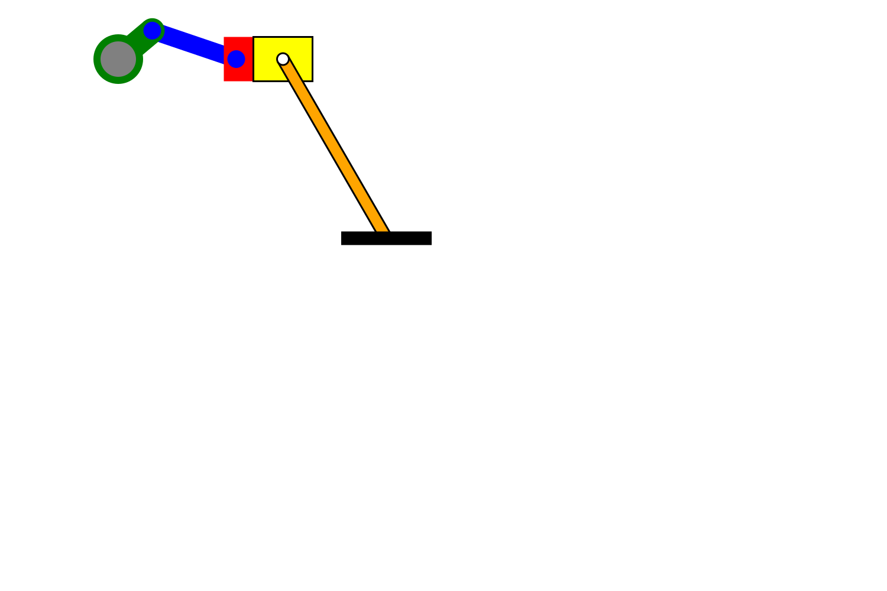
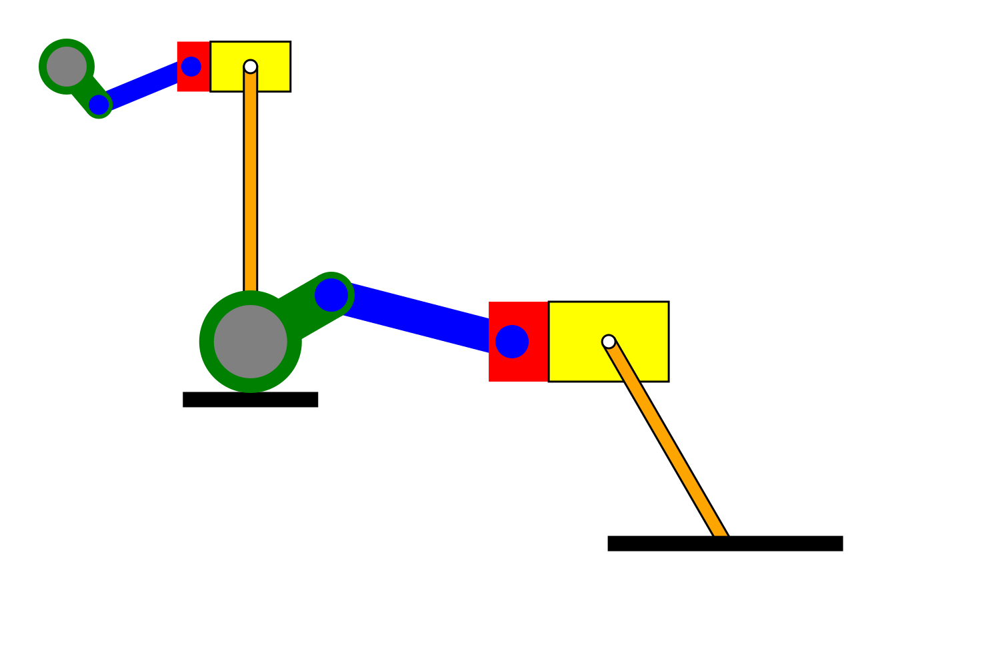

# First Assignment

Creare un programma C++ che produca un disegno SVG di un dispositivo meccanico. Succesivamente viene integrato un altro dispositvo, con lo scopo di creare un sistema meccanico complesso e assurdo.

NOTA IMPORTANTE: sia quando si compila il programma, sia quando si provano i test è necessario essere nella stessa cartella del main e non in altre sottocartelle (/build, /build/tests, ...)

## Parte 1

Dispositivo di base: carrello gru con asta rotante. Esso è costituito da un carro che si muove lungo l'asse orizzontale, un'asta che si può muovere come un pendolo e una piattaforma su cui vengono posizionati gli oggetti.

### Parametri: 
* length_shaft: lunghezza asta
* width_towtruck: larghezza carrello
* width_platform: larghezza piattaforma
* rotation: angolo di rotazione asta(misurato rispetto all'asse y; positivo --> rotazione senso orario)
* sliding: spostamento carello gru

### Misure fisse:
* larghezza asta
* altezza carrello
* altezza piattaforma
* coordinata y centro di istantanea rotazione
* raggio della coppia rotoidale che unisce asta e carrello
* coordinata y del carrello
centro di istantanea rotazione (Xcir,Ycir) --> punto attorno al quale l'asta ruota, corrisponde al
centro della coppia rotoidale che unisce asta e carrelo. Ycir è fissa, Xcir varia in
funzione dello spostamento del carrello lungo x

### Vincoli:
* lunghezza dell'asta, larghezza del carrello, della piattaforma e lo spostamento del carrello devono essere maggiori di zero
* la lunghezza dell'asta deve essere maggiore della somma della metà dell'altezza del carrello e metà dell'altezza della piattaforma 
* angolo di rotazione deve essere compreso tra -80 e 80 gradi
* la larghezza del carrello deve essere maggiore della larghezza dell'asta

## Parte 2

Realizzare una machine: combinazione tra il mio device e quello realizzato da [Matteo Albi](https://github.com/MatteoAlbi/tpa-homework1). L'unica differenza con quello originale di Matteo Albi è che è stato ruotato di -90 gradi per poterlo integrare meglio con il mio.
Biella-manovella + carrello-gru:

### Parametri: 
* XposMachine: coordinata x iniziale della machine, corrisponde alla coordinata x del centro dell'albero motore del primo device biella-manovella
* EbDevice** arr: array dinamico di puntatori a struct EbDevice
* LBAMTTdevice** arrBiellaManovella; array dinamico di puntatori a struct LBAMTTdevice
### Vincoli:
* angolo della manovella compreso tra 0 e 180 gradi (non vale per il primo device biella-manovella)
* vincoli di costruzione dei singoli device

Vi è la possibilità di integrare n coppie di device:

## Credits:

- MyFraction stuff: David Leoni
- original version: Luca Olivieri
